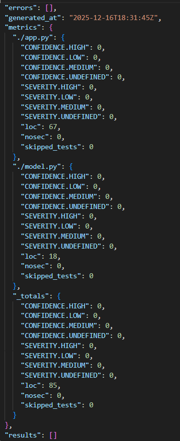
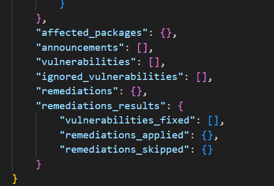

# Information Security REST API
## Описание

Это небольшое REST-API приложение на Flask с аутентификацией через JWT.

## API Методы (эндпоинты)

1. **POST /auth/login**
   - Аутентификация пользователя.
   - Возвращает JWT токен.
   - Тело запроса: `{"login": "test", "password": "password"}`
   - Ответ: `{"token": <jwt token>}`

2. **GET /api/data**
   - Получение списка постов
   - Требуется аутентификация
   - Заголовок: `Authorization: Bearer <jwt token>`
   - Ответ: `{[{"id": post.id, "title": post.title, "content": post.content, "user_id": post.user_id}, ...]}`

3. **POST /api/data**
   - Создание нового поста 
   - Требуется аутентификация
   - Заголовок: `Authorization: Bearer <jwt token>`
   - Тело запроса: `{"title": "Title", "content": "Content"}`
   - Ответ: `{"id": post.id}`

## Реализованные меры защиты

1. **SQLi**:
	- Для взаимодействия с базой данных PostgreSQL используется ORM SQLAlchemy. Все запросы к БД (например, User.query.filter_by(login=...)) автоматически преобразуются в параметризованные SQL-запросы, что полностью исключает возможность внедрения SQL-кода через пользовательский ввод.
2. **XSS**: 
	- Весь пользовательский ввод экранируются через `html.escape()`.
3. **Broken Authentication**:
	- Пароли хэшируются с помощью `bcrypt`.
	- Аутентификация через JWT с 1-часовым сроком действия.
	- Все защищённые эндпоинты проверяют токен.
## CI/CD

Настроены GitHub Actions:
- **SAST**: `bandit` сканирует код на уязвимости.
- **SCA**: `safety` проверяет зависимости.

### Отчёты 
* **bandit report**
  * 

* **safety report**
  * 